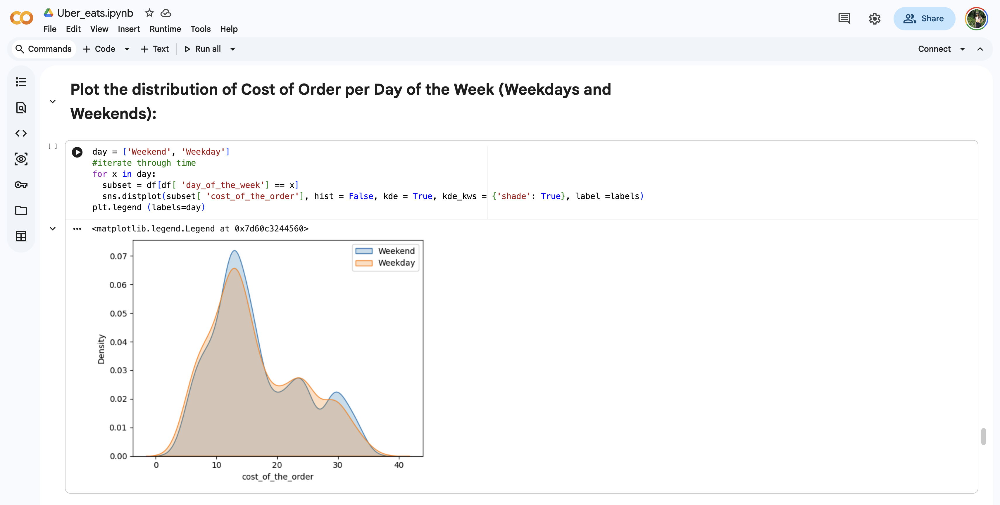
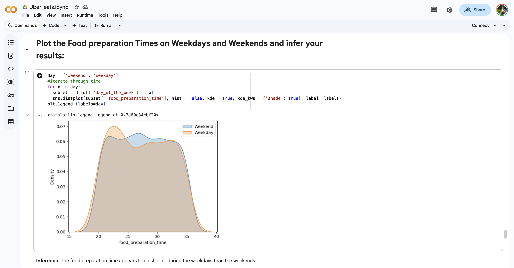
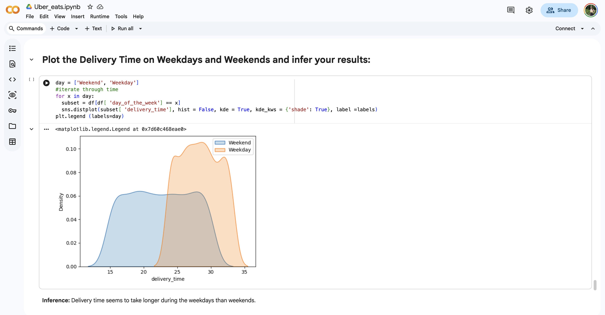

# Uber Eats Data Analysis

## Overview
This project focuses on analyzing Uber Eats/food delivery data to identify customer ordering behavior, restaurant performance, delivery trends, and business insights using data analysis and visualization techniques.

## Problem Statement
The goal of this project is to analyze food delivery data and extract meaningful insights that can help improve customer satisfaction, delivery efficiency, and business decision-making.

## Technologies Used
- Python
- Pandas
- NumPy
- Matplotlib
- Seaborn
- Jupyter Notebook

## Features
- Data cleaning and preprocessing
- Exploratory Data Analysis (EDA)
- Visualization of delivery and order trends
- Customer behavior analysis
- Restaurant performance analysis
- Business insights generation

## Data Analysis Concepts
- Data preprocessing
- Data visualization
- Trend analysis
- Correlation analysis
- Business analytics

## Results
The project successfully analyzed food delivery patterns and generated useful visual insights related to customer orders, restaurant performance, and delivery operations.

## Output Screenshots

### Data Visualization

## How to Run
1. Clone the repository
2. Install required libraries using requirements.txt
3. Open the notebook in Jupyter Notebook or Google Colab
4. Run all cells

## Future Improvements
- Build a recommendation system
- Add predictive analytics
- Create an interactive dashboard using Power BI or Tableau

## Author
Rutvi Patel
